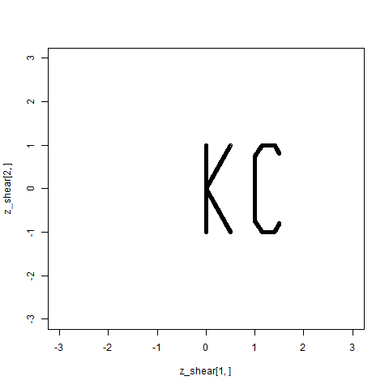

```{r setup}
library(animation)
library(rgl)
library(gifski)
library(knitr)
```

# Assignment

For this assignment, build the first letters for both your first and last name using point plots in R. Then, write R code that will left multiply (%>%) a square matrix (x) against each of the vectors of points (y). Initially, that square matrix will be the Identity matrix. Use a loop that changes the transformation matrix incrementally to demonstrate 1) shear, 2) scaling, 3)  rotation , and 4) projection in animated fashion.

# Response

I'll begin by plotting out my initials, KC. As in the provided example, I'll capture x and y in a 2x500 matrix, [Z].

```{r}
x = c(
  rep(0,100),
  seq(0,0.5, length.out=100),
  seq(0,0.5, length.out=100),
  rep(1,50),
  seq(1,1.15, length.out=25),
  seq(1,1.15, length.out=25),
  seq(1.15,1.4, length.out=25),
  seq(1.15,1.4, length.out=25),
  seq(1.4,1.5, length.out=25),
  seq(1.4,1.5, length.out=25)
)

y = c(
  seq(-1,1, length.out=100),
  seq(0,1, length.out=100),
  seq(0,-1, length.out=100),
  seq(-0.75,0.75, length.out=50),
  seq(-0.75,-1, length.out=25),
  seq(0.75,1, length.out=25),
  rep(1,25),
  rep(-1,25),
  seq(-1,-0.8, length.out=25),
  seq(1,0.8, length.out=25)
)

z = rbind(x,y)

plot(y~x, xlim=c(-3,3), ylim=c(-3,3))
```

Next, I'll demonstrate a simple shear. In 2d, the shear transformation matrix is made by taking an identity matrix and then converting the two zeros, i.e. $[M]_{12}$ and $[M]_{21}$, to scalars. Here, we change $[M]_{12}$ to a 1.

```{r}
shear = matrix(c(1,0,1,1), nrow = 2)

z_shear = matrix(nrow = 2, ncol =  ncol(z))

for (col in col(z)) {
  z_shear[,col] <- z[,col] %*% shear
}

plot(z_shear[2,] ~ z_shear[1,], xlim=c(-3,3), ylim=c(-3,3))
```

I'll now animate this transformation, looping through 30 "frames" to slowly move $[M]_{12}$ from 0 to 1, thus transforming the matrix from its starting point to a vertical shear.

```{r}
z_shear = matrix(nrow = 2, ncol =  ncol(z))

saveGIF({
  for (i in seq(0, 1, length.out = 30)) {
    shear = matrix(c(1,0,i,1), nrow = 2)
    for (col in col(z)) {
      z_shear[,col] <- z[,col] %*% shear
    }
    plot(z_shear[2,] ~ z_shear[1,], xlim=c(-3,3), ylim=c(-3,3))
  }

}, interval = 0.05, movie.name = 'kc_shear.gif')


```

We can also move $[M]_{12}$ to -1 to shear in the opposite direction. I'll move the KC plot through both to show the difference. To make the code a bit cleaner, I'll write the animation loop as a function.

```{r}
shear_plot <- function(start, end) {
  z_transformed = matrix(nrow = 2, ncol =  ncol(z))
  for (i in seq(start, end, length.out = 30)) {
    transformation <- matrix(c(1,0,i,1), nrow = 2)
    for (col in col(z)) {
      z_transformed[,col] <- z[,col] %*% transformation
    }
    plot(z_transformed[2,] ~ z_transformed[1,], xlim=c(-3,3), ylim=c(-3,3))
  }
}

saveGIF({
  shear_plot(0, 1)
  shear_plot(1, 0)
  shear_plot(0, -1)
  shear_plot(-1, 0)
}, interval = 0.05, movie.name = 'kc_shear2.gif')

include_graphics('kc_shear2.gif')
```

To wrap up shears, I'll animate a horizontal shear, which requires us to instead replace $[M]_{21}$ with scalars.

```{r}
shear_plot_hori <- function(start, end) {
  z_transformed = matrix(nrow = 2, ncol =  ncol(z))
  for (i in seq(start, end, length.out = 30)) {
    transformation <- matrix(c(1,i,0,1), nrow = 2)
    for (col in col(z)) {
      z_transformed[,col] <- z[,col] %*% transformation
    }
    plot(z_transformed[2,] ~ z_transformed[1,], xlim=c(-3,3), ylim=c(-3,3))
  }
}

saveGIF({
  shear_plot_hori(0, 1)
  shear_plot_hori(1, 0)
  shear_plot_hori(0, -1)
  shear_plot_hori(-1, 0)
}, interval = 0.05, movie.name = 'kc_shear3.gif')

include_graphics('kc_shear3.gif')
```

Next, I'll scale the plot, i.e. make it larger and smaller. This requires adjusting the ones along the diagonal of our starting identify matrix, i.e. $[M]_{11}$ and $[M]_{22}$. First, we'll scale the KC vertically, shrinking the plot (moving $[M]_{22}$ from 1 to 0), then blowing it up (moving $[M]_{22}$ up to 2).

```{r}
scale_plot_vert <- function(start, end) {
  z_transformed = matrix(nrow = 2, ncol =  ncol(z))
  for (i in seq(start, end, length.out = 30)) {
    transformation <- matrix(c(1,0,0,i), nrow = 2)
    for (col in col(z)) {
      z_transformed[,col] <- z[,col] %*% transformation
    }
    plot(z_transformed[2,] ~ z_transformed[1,], xlim=c(-3,3), ylim=c(-3,3))
  }
}

saveGIF({
  scale_plot_vert(1, 0)
  scale_plot_vert(0, 2)
  scale_plot_vert(2, 1)
}, interval = 0.05, movie.name = 'kc_scale.gif')

include_graphics('kc_scale.gif')
```

Next, I'll scale the plot horizontally.

```{r}
scale_plot_horz <- function(start, end) {
  z_transformed = matrix(nrow = 2, ncol =  ncol(z))
  for (i in seq(start, end, length.out = 30)) {
    transformation <- matrix(c(i,0,0,1), nrow = 2)
    for (col in col(z)) {
      z_transformed[,col] <- z[,col] %*% transformation
    }
    plot(z_transformed[2,] ~ z_transformed[1,], xlim=c(-3,3), ylim=c(-3,3))
  }
}

saveGIF({
  scale_plot_horz(0, 2)
  scale_plot_horz(2, 0)
  scale_plot_horz(0, -2)
  scale_plot_horz(-2, 0)
}, interval = 0.05, movie.name = 'kc_scale2.gif')

include_graphics('kc_scale2.gif')
```

Our next transformation is rotation, which requires a transformation matrix in which $[M]_{11}=cos(\theta)$, $[M]_{12}=-sin(\theta)$, $[M]_{21}=sin(\theta)$, and $[M]_{22}=cos(\theta)$. Varied values of $\theta$ will rotate the plot about the origin.

```{r}
rotate_plot <- function(start, end) {
  z_transformed = matrix(nrow = 2, ncol =  ncol(z))
  for (i in seq(start, end, length.out = 30)) {
    transformation <- matrix(c(cos(i),sin(i),-sin(i),cos(i)), nrow = 2)
    for (col in col(z)) {
      z_transformed[,col] <- z[,col] %*% transformation
    }
    plot(z_transformed[2,] ~ z_transformed[1,], xlim=c(-3,3), ylim=c(-3,3))
  }
}

saveGIF({
  rotate_plot(0,3.1)
  rotate_plot(-3.1,0)
}, interval = 0.05, movie.name = 'kc_rotate.gif')

include_graphics('kc_rotate.gif')
```

Finally, we'll work on the projection transformation. As I understand, this transformation actually takes place in 3 dimensions. We can add a third dimension to [Z], then plot it as before, but it's a bit difficult to see the KC actually "flip" as it should.

```{r}
project_plot <- function(start, end) {
  z_transformed <- matrix(nrow = 3, ncol =  ncol(z))
  z_new <- rbind(z, rep(0, ncol(z)))
  for (i in seq(start, end, length.out = 30)) {
    transformation <- matrix(c(1,0,0,
                               0,cos(i),-sin(i),
                               1,sin(i),cos(i)),
                             nrow=3)
    for (col in col(z)) {
      z_transformed[,col] <- z_new[,col] %*% transformation
    }
    plot(z_transformed[2,] ~ z_transformed[1,], xlim=c(-3,3), ylim=c(-3,3))
  }
}

saveGIF({
  project_plot(0,3.1)
  project_plot(-3.1,0)
}, interval = 0.05, movie.name = 'kc_projection.gif')

include_graphics('kc_projection.gif')
```

To better see the transformation in action, we can move this animation to a 3d plot.

```{r}
project_plot_3d <- function(start, end) {
  z_transformed <- matrix(nrow = 3, ncol =  ncol(z))
  z_new <- rbind(z, rep(0, ncol(z)))
  frame <- 0
  for (i in seq(start, end, length.out = 30)) {
    frame <- frame + 1
    transformation <- matrix(c(1,0,0,
                               0,cos(i),-sin(i),
                               1,sin(i),cos(i)),
                             nrow=3)
    for (col in col(z)) {
      z_transformed[,col] <- z_new[,col] %*% transformation
    }
    plot3d(
      x = z_transformed[1,], y = z_transformed[2,], z = z_transformed[3,],
      xlim = c(-3,3), ylim = c(-3,3), zlim = c(-3,3),
      type = 'p',
      radius = .1
    )
    png <- sprintf('kc_pic%02d.png', frame)
    snapshot3d(png, webshot = FALSE)
    clear3d()
  }
}

project_plot_3d(0,3.1)
project_plot_3d(-3.1,0)
rgl.close()

pngFiles <- Sys.glob('kc_pic*.png')
gifski(
  pngFiles, 'kc_projection3d.gif',
  width = 2000, height = 2000,
  delay = 1/20
)

include_graphics('kc_projection3d.gif')
Sys.sleep(1)
file.remove(pngFiles)
```

Finally, we have a quick plot combining all transformations (back in 2d).

```{r}
saveGIF({

  shear_plot(0, 1)
  shear_plot(1, 0)
  shear_plot(0, -1)
  shear_plot(-1, 0)

  shear_plot_hori(0, 1)
  shear_plot_hori(1, 0)
  shear_plot_hori(0, -1)
  shear_plot_hori(-1, 0)

  scale_plot_vert(1, 0)
  scale_plot_vert(0, 2)
  scale_plot_vert(2, 1)

  scale_plot_horz(1, 2)
  scale_plot_horz(2, 0)
  scale_plot_horz(0, -2)
  scale_plot_horz(-2, 1)

  rotate_plot(0,3.1)
  rotate_plot(-3.1,0)

  project_plot(0,3.1)
  project_plot(-3.1,0)
  
}, interval = 0.025, movie.name = 'kc_combo.gif')

include_graphics('kc_combo.gif')
```


