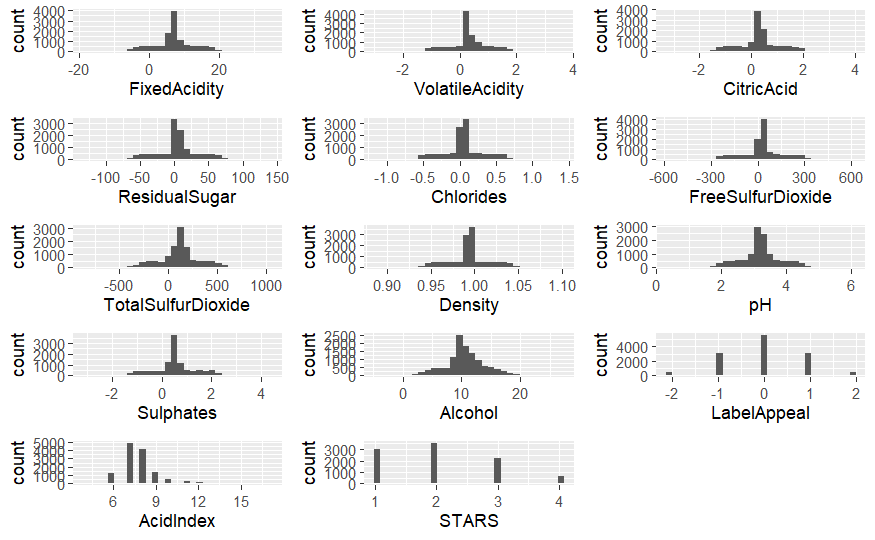
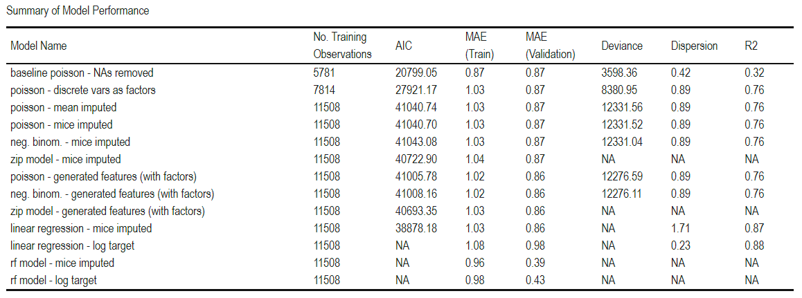

```{r setup, include=FALSE}
knitr::opts_chunk$set(echo = TRUE)
```

# Introduction

This assignment tasked us with predicting a discrete count variable: the number of cases of wine sold to distribution companies after sampling. The dataset contains variables detailing various chemical characteristics of the wine, as well as ratings from industry experts. The dataset is characterized by a large volume of missing observations, which introduced challenges in terms of model performance. Ultimately, we found that linear approaches struggled to capture the relationship between the predictors and sales, with average prediction errors around 1 box. Some non-linear approaches, however, showed promising results.

# Data Exploration

The data covers 12,795 types of wine. For each type of wine, the dataset details 12 chemical properties (e.g., the level of alcohol, chlorides, sulfates, citric acid), two ratings (e.g., expert tasters' ratings and marketing ratings) and the number of cases sold to distributors.

The target variable (cases sold) consists of positive, discrete value (see `Figure 1`). Moreover, the distribution exhibits slight right skew, indicating that a Poisson distribution may provide an appropriate fit for modeling. The target, however, also contains a significant number of wines for which zero cases were sold. This finding indicated that our model would need to include a zero-inflation factor.


The predictor variables include mostly continuous chemical measurements, all of which were roughly normally distributed (see `Figure 2`). There were, however, three exceptions: `AcidIndex` (a discrete measure of acidity), `LabelAppeal` (a marketing rating on how customers respond to the wine label) and `STARS` (a taste rating). `AcidIndex` covers a relatively wide range, and it is based on a weighted average. It therefore appears best left as a numerical value. `LabelAppeal` and `STARS`, however, cover only five and four discrete values, respectively. Moreover, they are more subjective measures. As a result, we predicted these features may be best dealt with as categorical variables.



To get a quick snapshot of relationships across all variables, we generated a correlation matrix (see `Figure 3`). It is important to recognize the limitations of this plot when dealing with count regression modeling. Specifically, these models typically use a log link function, and the target variables typically exhibit skewness, and the such models typically use a log link function. So, Pearson's correlation may not be the best indicator of relevant relationships. Still, these plots can identify multicollinearity. Moreover, a correlation matrix with the target variable log-transformed (also included below) can provide a better view of potential predictors. Unfortunately, the plot indicated relatively weak relationships across all variables. The exceptions were `AcidIndex`, `LabelAppeal` and `STARS`, which appeared weakly correlated with the target in both raw and log-transformed states.


Finally, we examined missing values in our data. The upset plot below (see `Figure 4`) shows the variables with the highest frequency of missing values. We found over 2,500 observations for which the `STARS` rating is not available, and multiple other variables with hundreds of missing values. To avoid losing a significant portion of our training data, we predicted we would need to consider imputation.


# Data Preparation

To prepare our data for modeling, we first created a validation subset to provide an unbiased estimate of model performance. We wanted to use this subset to provide feedback on models both with and without imputation, so we first removed all NAs, giving us 6436 complete observations. Then, we randomly sampled 20% of these observations, giving us 1287 observations for validation. The validation subset therefore comprised ~10% of the original 12,795 observations, leaving 11,508 observations for training.

We then took an iterative approach to generate multiple datasets for modeling. The goal was to allow us to view incremental impacts of various preprocessing steps on model performance.  

  • First, we created a training set with all NAs removed, leaving 6436 observations (as noted above). All variables were left as is, including `LabelAppeal` and `STARS`, which we left as numerical variables. The goal for this dataset was to provide a baseline for performance.
  
  • Next, we converted the `STARS` variable to a factor and adding a new level (`missing`) to denote when the rating was not available. Given the large volume of NAs (~2,500) under this predictor, we predicted that the missing values may actually serve as a sort of signal to the model. In this dataset, we also converted the other categorical variable, `LabelAppeal` from numerical to factor format. With the `STARS` NAs filled in, the dataset had 8675 total observations for training.  
  
  • We then created two datasets with imputed values for the remaining numerical variables. The first leveraged a simple mean imputation, and the second leveraged the MICE (Multiple Imputation by Chained Equations) method. This approach imputes missing data by iteratively modeling each variable with missing values as a function of the other variables, with the goal of minimizing the distortions that may come with simpler imputation methods. With all NAs imputed, this dataset returned to the original count of 11,508 observations for training.  
  • Given the minimal correlation shown in our correlation matrices, we created another dataset with additional generated features. Specifically, we added polynomial terms for all 12 numerical variables. We also predicted that the interactions of chemical attributes may better explain consumer tastes and preferences, so we generated pairwise interactions terms, bringing the total number of features to 78. When then enacted backward stepwise feature elimination to remove insignificant variables, bring the feature set back down to 24 variables.
  
With all of these steps, we created a complete validation dataset, as well as a series of training datasets that accounted for missing values, categorical variables, potential interactions and non-linear relationships.

# Build Models

For all of the above training datasets, we fit Poisson regression models. As uncovered during data exploration, the target variable consistents of positive counts and exhibits a slight right skew. Both of these conditions indicate a good fit for Poisson modeling. For all models, we assessed the residuals, dispersion, deviance, mean absolute error (MAE) and Akaike information criterion (AIC). We cover each of these below, with results summarized in the table at the end of this section (see `Figure 6`).

Regarding residuals, we analysed the scatterplot of Pearson residuals against fitted values (see `Figure 5`). We observed the "banding" pattern shown below, but we recognized this is common with Poisson count models (given the discrete nature of the response variable). Ideally, the residuals should exhibit constant spread, and while the plot appeared appropriate overall, we did observe a slight curve, particularly with the red trend line. This indicated some potential non-linearity in the relationship between predictors and response. Interestingly, the introduction of polynomial and interaction terms appeared to at least partially address this. The same residual plot for the model including factor variables, imputed numerical variables and generated features exhibited no such curve.


Regarding dispersion, we wanted to ensure that we adhered to the primary assumption for Poisson modeling: that mean and variance are equal. Dispersion provide an assessment of that adherence, calculated as sum of squared Pearson residuals divided by the residual degrees of freedom. While our baseline model exhibited significant underdispersion (indicating the model may be too simple), most of the other models had dispersion metrics near 1, indicating a good fit. However, one model (the one based on generated numerical features) did exhibit overdispersion. We therefore fit this same data with a negative binomial model. While the updated model did show more appropriate dispersion (very close to 1), the overall model fit metrics did not improve.

Finally, we also examined AIC, MAE (both across training and validation subsets) and deviance. These metrics provide an indication of model fit, prediction errors and comparison to a fully saturated model (i.e., a model that perfectly predicts the observed data under the Poisson distribution). In all cases, lower values indicate a better fit. The results are collected in `Figure 6`.

  • Surprisingly, the baseline model shows some of the best performance, with low AIC and Deviance, and comparable out-of-sample errors. The second model (with categorical variables converted to factors and missing values added as another level) provideds comparable performance. Unfortunately, these models are unable to handle observations with missing values, making it unfit for purpose.  
  
  • The models containing only numerical features all exhibit some of the worst performance, with very high AIC and Deviance, as well as high errors.  
  
  • The four remaining models (the two models with all imputed values, the model with the combination of generated numerical features and factors, and the zero-inflation Poisson model) all exhibit comparable performance. 
  
Ultimately, it seems that the various enhancements we pursued (i.e., imputation, feature generation, alternative frameworks like negative binomial and zero-inflation) did little to improve model performance. We suspect that the feature set does not provide sufficient information to accurately predict sales, and/or that the GLM framework fails to capture the relationships between predictors and response. 

For the sake of comparison, we also fit two models that do not rely on a linear framework. Specifically, we used the ensemble decision tree approach, random forest, which can better capture non-linear relationships. We fit two models, one that directly aimed to predict the target variable in discrete form, and another that captured the log-transformed target. Surprisingly, these `rf` models provided similar performance in sample, but its out-of-sample performance appeared much better. 



# Model Selection

TBD

\newpage

# Appendix

```{r ref.label=knitr::all_labels(), echo=TRUE, eval=FALSE}
# Load required libraries
library(tidyverse) 
library(ggplot2) 
library(corrplot)
library(psych)
library(naniar)
library(cowplot)
library(mice)
library(pscl)
library(MASS)
library(randomForest)
library(knitr)
library(kableExtra)


# Data Exploration


# Load the data
wine_data <- read.csv("wine-training-data.csv")

# Glimpse
glimpse(wine_data)


### Summary


# Drop index
wine_data <- wine_data %>%
  dplyr::select(-INDEX)

# Summary statistics for the dataset
summary_stats <- describe(wine_data)
print(summary_stats)


### NAs


# Check for missing values
missing_values <- colSums(is.na(wine_data))
print(missing_values)


# Missing value patterns
naniar_plot <- gg_miss_var(wine_data, show_pct = TRUE) +
  labs(title = "Missing Data Patterns", x = "Variables", y = "Number of Missing Values") +
  theme_minimal()

print(naniar_plot)

# Create a heatmap of missing values
gg_miss_upset(wine_data)


### Correlation across features


# Correlation matrix for numerical variables
numerical_vars <- wine_data %>% select_if(is.numeric)
correlation_matrix_1 <- cor(numerical_vars, use = "pairwise.complete.obs")

# With log target
numerical_vars$TARGET <- log(numerical_vars$TARGET+1)
correlation_matrix_2 <- cor(numerical_vars, use = "pairwise.complete.obs")

# Plot the heatmap
corrplot(correlation_matrix_1, method = "color", type = "lower", title = "Untransformed Target", mar = c(1, 1, 2, 1))
corrplot(correlation_matrix_2, method = "color", type = "lower", title = "Log-transformed Target", mar = c(1, 1, 2, 1))


### Distributions


# Histograms for numerical vars
histograms <- lapply(names(dplyr::select(numerical_vars, -TARGET)), function(var) {
  ggplot(wine_data, aes_string(x = var)) +
    geom_histogram()
})

# Arrange histograms in a grid
histogram_grid <- plot_grid(plotlist = histograms, ncol = 3)

# Save or display the plot grid
print(histogram_grid)


# Histogram for target variable
ggplot(wine_data, aes(x = TARGET)) +
  geom_bar() +
  labs(title = "Distribution of TARGET (Cases Purchased)", x = "TARGET", y = "Frequency")


variables <- names(wine_data)[!names(wine_data) %in% c("TARGET")]

plots <- lapply(variables, function(var) {
  ggplot(wine_data, aes_string(x = var, y = "TARGET")) +
    geom_point() 
})

# Arrange the plots in a grid (5 rows x 3 columns)
grid_plot <- plot_grid(plotlist = plots, nrow = 5, ncol = 3, rel_heights = c(2,2,2,2,2))

print(grid_plot)


variables <- names(wine_data)[!names(wine_data) %in% c("TARGET")]

plots <- lapply(variables, function(var) {
  ggplot(wine_data, aes_string(x = var, y = "TARGET")) +
    geom_point() 
})

plots


# Evaluation Data


# Remove all rows with missing values from the original data
complete_data <- na.omit(wine_data)

# Determine the number of rows you want in the validation set
set.seed(123) # for reproducibility
validation_size <- floor(0.2 * nrow(complete_data)) # 20% as an example

# Randomly select rows for the validation set
validation_indices <- sample(seq_len(nrow(complete_data)), size = validation_size)

# Create the validation subset with no NAs
validation_data <- complete_data[validation_indices, ]

# (Optional) Create a training subset from the remaining rows
wine_data <- wine_data[-validation_indices, ]

paste('Rows in Training Data', nrow(training_data))
paste('Rows in Validation Data', nrow(validation_data))


# Modeling


# Initialize an empty results data frame
results_df <- data.frame(
  ModelName = character(),
  RowsInTrain = numeric(),
  AIC = numeric(),
  MAE_Train = numeric(),
  MAE_Val = numeric(),
  Deviance = numeric(),
  Dispersion = numeric(),
  stringsAsFactors = FALSE
)

# Function for updating the df
update_results <- function(results_df, model, training_data, validation_data, name) {
  # Generate Predictions
  predicted_train <- predict(model, type = "response")
  actual_train <- training_data$TARGET
  
  predicted_val <- predict(model, newdata=validation_data, type = "response")
  actual_val <- validation_data$TARGET
  
  # Assign variables
  name <- name
  mae_train <- mean(abs(actual_train - predicted_train), na.rm = TRUE)
  mae_val <- mean(abs(actual_val - predicted_val), na.rm = TRUE)
  deviance <- model$deviance
  dispersion <- sum(residuals(model, type = "pearson")^2) / df.residual(model)
  
  # Error handling
  if (is.null(deviance)) deviance <- NA
  if (is.null(dispersion) || length(dispersion) == 0) dispersion <- NA
  
  aic <- tryCatch({
    AIC(model)
  }, error = function(e) {
    NA
  })
  
  # Add to df
  results_df <- rbind(results_df, data.frame(
    ModelName = name,
    RowsInTrain = nrow(training_data),
    AIC = aic,
    MAE_Train = mae_train,
    MAE_Val = mae_val,
    Deviance = deviance,
    Dispersion = dispersion,
    stringsAsFactors = FALSE
  ))
  
  return(results_df)
}


### Baseline - with NAs removed


nrow(wine_data)
nrow(na.omit(wine_data))

wine_data_naomit <- na.omit(wine_data)


# Fit a Poisson GLM with NAs omitted, as baseline
poisson_model_naomit <- glm(TARGET ~ ., family = poisson(link = "log"), data = wine_data_naomit)
summary(poisson_model_naomit)


plot(poisson_model_naomit)


results_df <- update_results(
  results_df, poisson_model_naomit, wine_data_naomit, validation_data, 'baseline poisson - NAs removed'
)
results_df


### Convert to factors


# Replace NAs with 0 in STARS
wine_data[is.na(wine_data$STARS), 'STARS'] <- "Missing"

# Convert to factor
wine_data$STARS <- factor(wine_data$STARS)
wine_data$LabelAppeal <- factor(wine_data$LabelAppeal)

# Same for validation
validation_data[is.na(validation_data$STARS), 'STARS'] <- "Missing"
validation_data$STARS <- factor(validation_data$STARS, levels = levels(wine_data$STARS))
validation_data$LabelAppeal <- factor(validation_data$LabelAppeal, levels = levels(wine_data$LabelAppeal))

# Check number of rows with NAs
nrow(na.omit(wine_data))


# Fit a Poisson GLM
poisson_model_factor <- glm(TARGET ~ . - 1, family = poisson(link = "log"), data = wine_data)
summary(poisson_model_factor)


plot(poisson_model_factor)


results_df <- update_results(
  results_df, poisson_model_factor, na.omit(wine_data), validation_data, 'poisson - discrete vars as factors'
)
results_df


### Impute Numeric vars


wine_data_mean_imp <- wine_data

# Identify numeric columns
num_cols <- sapply(wine_data_mean_imp, is.numeric)

# For each numeric column with NAs, fill them with the column mean
for (col_name in names(wine_data_mean_imp)[num_cols]) {
  missing_indices <- is.na(wine_data_mean_imp[[col_name]])
  if (any(missing_indices)) {
    col_mean <- mean(wine_data_mean_imp[[col_name]], na.rm = TRUE)
    wine_data_mean_imp[[col_name]][missing_indices] <- col_mean
  }
}

# Fit a Poisson GLM
poisson_model_mean_impute <- glm(TARGET ~ . - 1, family = poisson(link = "log"), data = wine_data_mean_imp)
summary(poisson_model_mean_impute)


results_df <- update_results(
  results_df, poisson_model_mean_impute, wine_data_mean_imp, validation_data, 'poisson - mean imputed'
)
results_df


imputed_data <- mice(wine_data, m = 5, method = "pmm", seed = 123)
wine_data_mice_imp <- complete(imputed_data, action = 1)

poisson_model_mice_impute <- glm(TARGET ~ . - 1, family = poisson(link = "log"), data = wine_data_mice_imp)
summary(poisson_model_mice_impute)


results_df <- update_results(
  results_df, poisson_model_mice_impute, wine_data_mice_imp, validation_data, 'poisson - mice imputed'
)
results_df


wine_data <- wine_data_mice_imp


### Additional Features


# Identify numeric columns
num_cols <- sapply(wine_data, is.numeric)
vars <- names(wine_data)[num_cols]
vars <- setdiff(vars, "TARGET")

# Create a formula with all numeric variables, their pairwise interactions (^2),
# and squared polynomial terms (I(var^2))
f <- as.formula(
  paste("~ (", paste(vars, collapse=" + "), ")^2 +",
        paste(sapply(vars, function(v) paste0("I(", v, "^2)")), collapse=" + "))
)

# Generate the model matrix from the formula (remove the intercept column)
mm <- model.matrix(f, data = wine_data)[, -1]
mm_new_features <- mm[, !colnames(mm) %in% vars]

# Add the generated terms to the original data frame
wine_data_genFeatures <- data.frame(cbind(wine_data['TARGET'], mm_new_features))
names(wine_data_genFeatures) <- make.names(names(wine_data_genFeatures))
wine_data_genFeatures

# Same for validation data
validation_mm <- model.matrix(f, data = validation_data)[, -1]
validation_new_features <- validation_mm[, !colnames(validation_mm) %in% vars]
validation_data_genFeatures <- data.frame(cbind(validation_data['TARGET'], validation_new_features))
names(validation_new_features) <- make.names(names(validation_new_features))


# Stepwise elimination based on p-values
p_threshold <- 0.05
feature_selection_data <- wine_data_genFeatures

for (i in 1:(ncol(feature_selection_data)-1)) {
  # Fit model (no intercept)
  feature_selection_model <- glm(TARGET ~ . - 1, family = poisson, data = feature_selection_data)
  
  # Get p-values for all predictors (no intercept to remove)
  p_vals <- summary(feature_selection_model)$coefficients[, 4]
  
  # Identify the predictor with the highest p-value
  max_p <- max(p_vals, na.rm = TRUE)  # No [-1] since no intercept
  if (max_p < p_threshold) {
    message("STOPPING POINT!")
    break
  }
  
  # Find the predictor with the highest p-value
  worst_predictor <- names(p_vals)[which.max(p_vals)]
  
  # Remove the worst predictor by exact name, but only if not factor var
  worst_predictor <- make.names(worst_predictor)
  feature_selection_data <- dplyr::select(feature_selection_data, -all_of(worst_predictor))
}

summary(feature_selection_model)


# Filter out removed variables from val data
selected_features <- colnames(feature_selection_data)
validation_data_genFeatures <- validation_data_genFeatures[, selected_features, drop = FALSE]

results_df <- update_results(
  results_df, feature_selection_model, feature_selection_data, validation_data_genFeatures, 'poisson - generated features (num. only)'
)
results_df


### Negative Binomial


# Fit a Negative Binomial regression
nb_model <- glm.nb(TARGET ~ ., data = feature_selection_data)
summary(nb_model)


plot(nb_model)


results_df <- update_results(
  results_df, nb_model, feature_selection_data, validation_data_genFeatures, 'neg. binom. - generated features (num. only)'
)
results_df


### Add back factor variables


wine_data_genFeatures <- cbind(feature_selection_data, dplyr::select(wine_data, STARS, LabelAppeal))
poisson_model_genFeatures <- glm(TARGET ~ . - 1, family = poisson, data = wine_data_genFeatures)
summary(poisson_model_genFeatures)


plot(poisson_model_genFeatures)


validation_data_genFeatures <- cbind(validation_data_genFeatures, dplyr::select(validation_data, STARS, LabelAppeal))

results_df <- update_results(
  results_df, poisson_model_genFeatures, wine_data_genFeatures, validation_data_genFeatures, 'poisson - generated features (with factors)'
)
results_df


### Zero-Inflation


zip_model <- zeroinfl(TARGET ~ . | 1, dist = "poisson", data = wine_data)
summary(zip_model)


results_df <- update_results(results_df, zip_model, wine_data, validation_data, 'zip model')
results_df


### Random Forest


rf_model <- randomForest(TARGET ~ ., data = wine_data, ntree = 500)
summary(rf_model)


results_df <- update_results(results_df, rf_model, wine_data, validation_data, 'rf model')
results_df


### RF with Log TARGET


wine_data_log <- wine_data %>%
  mutate(TARGET = log(TARGET+1))
rf_model_log <- randomForest(TARGET ~ ., data = wine_data_log, ntree = 500)
summary(rf_model_log)


validation_data_log <- validation_data %>%
  mutate(TARGET = log(TARGET+1))

predicted_train <- predict(rf_model_log)
predicted_lin_space_train <- exp(predicted_train) - 1
mae_train <- mean(abs(wine_data$TARGET - predicted_lin_space_train))

predicted_val <- predict(rf_model_log, newdata=validation_data_log)
predicted_lin_space_val <- exp(predicted_val) - 1
mae_val <- mean(abs(validation_data$TARGET - predicted_lin_space_val))

results_df <- rbind(results_df, data.frame(
  ModelName = 'rf log target',
  RowsInTrain = nrow(wine_data_log),
  AIC = NA,
  MAE_Train = mae_train,
  MAE_Val = mae_val,
  Deviance = NA,
  Dispersion = NA,
  stringsAsFactors = FALSE
))

results_df


# Summary Table


results_df %>%
  kbl(
    caption = "Summary of Model Performance",
    col.names = c("Model Name", "No. Training Observations", "AIC", "MAE (Train)", "MAE (Validation)", "Deviance", "Dispersion"),
    digits = 2
  ) %>%
  kable_classic(position = 'center')
```


